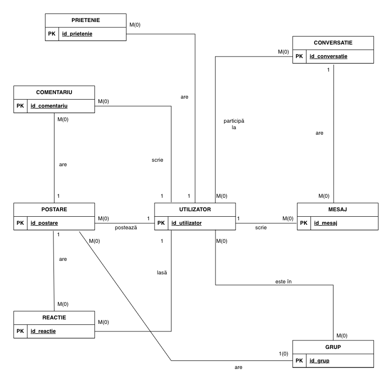
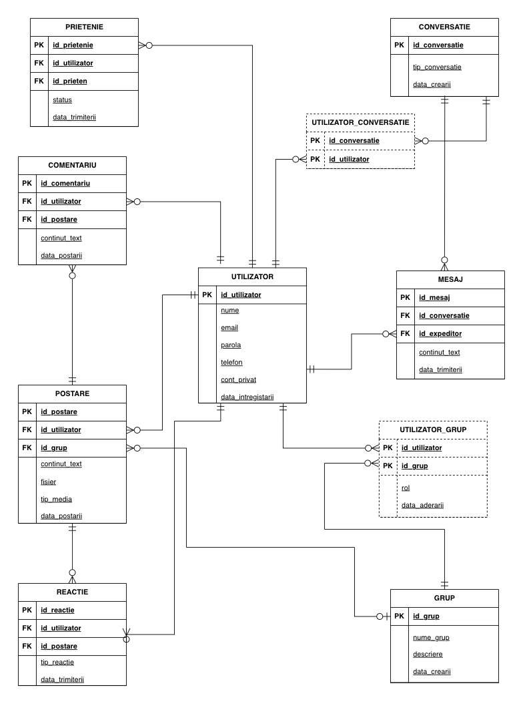

# Social DB Manager

This project implements the database layer for a Social Media Platform using Oracle PL/SQL. It includes a complete schema definition, data management scripts, and advanced database features like stored procedures, functions, and triggers.

## Project Structure

- **`src/`**: Contains the source SQL scripts.
    - `create_tables.sql`: DDL scripts to create tables and constraints.
    - `insert.sql`: DML scripts to populate the database with initial data.
    - `tasks.sql`: PL/SQL procedures, functions, and triggers implementing core logic.
    - `script.sql`: The entire script for the project including creating tables, inserting values and the tasks.
- **`doc/`**: Documentation files (Requirements, SGBD Documentation).
- **`diagrams/`**: Database diagrams.
- **`project.zip`**: The script and the documentation ready to download.

##  Database Schema

The database models a standard social network with the following core entities:

- **Users** (`UTILIZATOR`): specific details, private/public account settings.
- **Connections**: Friendships (`PRIETENIE`), Groups (`GRUP`), Group Memberships (`UTILIZATOR_GRUP`).
- **Content**: Posts (`POSTARE`), Comments (`COMENTARIU`), Reactions (`REACTIE`).
- **Communication**: Conversations (`CONVERSATIE`) and Messages (`MESAJ`).

### ERD Diagram

### Conceptual Diagram

## Features & PL/SQL Logic

### Stored Procedures
- **`p_afisare_profil_utilizator`**: Displays a user's full profile including friends list, recent groups, and activity statistics (posts/comments count).
- **`p_afisare_postari_prieteni`**: Fetches and displays posts from a user's friends using cursors.
- **`p_notificari`**: Generates a notification feed (friend requests, comments, reactions) with configurable limits.

### Functions
- **`f_cauta_continut`**: robust search function to find text within posts, returning author and location details.

### Triggers
- **Maintenance Mode**: Prevents data modification when the server is in maintenance mode.
- **Content Moderation**: Automatically blocks comments containing forbidden words.
- **Audit Logging**: Tracks all DDL changes (CREATE, DROP, ALTER) in an `ISTORIC_SCHIMBARI` table.

## Setup & Usage

To set up the database, run the scripts in the following order:

1.  **Create Tables**: Run `src/create_tables.sql`
2.  **Insert Data**: Run `src/insert.sql`
3.  **Load Logic**: Run `src/tasks.sql` to compile procedures and triggers.

